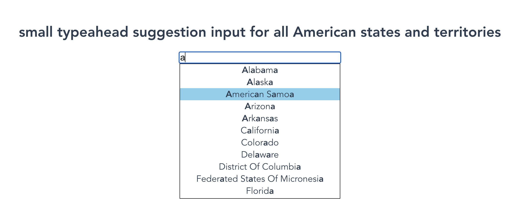

# Typeahead Suggestion Input

## Description
A small typeahead suggestion input for all American states and territories. Get all the US States data from GraphQL server first, then find out the States containing the user input content by calling findSuggestions() function.

other related same result projects:
* https://github.com/Jiafan-Qian/typeahead-input-2

## Demo




## Technologies Used
* frontend: Vue.js
* backend: Express.js + GraphQL

## Project Setup and Run
Use two terminals:

* server:
```
cd server
npm install
node server.js
```

* Vue app:
```
cd typeahead-search-demo
npm install
npm run serve
```
Then navigate to http://localhost:8080/

## Reference
Websites and Videos I used to study for this project:

* Vue.js: https://vuejs.org/v2/guide/
* Vue Mastery: https://www.vuemastery.com/courses/intro-to-vue-js/vue-instance/
* Getting started with Vue - Learn web development | MDN: https://developer.mozilla.org/en-US/docs/Learn/Tools_and_testing/Client-side_JavaScript_frameworks/Vue_getting_started
* GraphQL | A query language for your API: https://graphql.org/graphql-js/
* Build a Simple API Service with Express and GraphQL: https://developer.okta.com/blog/2018/09/27/build-a-simple-api-service-with-express-and-graphql
* How to serve Vue App with Express - BezKoder: https://bezkoder.com/serve-vue-app-express/
* Vue.js Express Tutorial: https://vegibit.com/vue-js-express-tutorial/
* Query A GraphQL API With Vue.js And Axios: https://www.youtube.com/watch?v=IbgT5aCMYC8&t=231s
